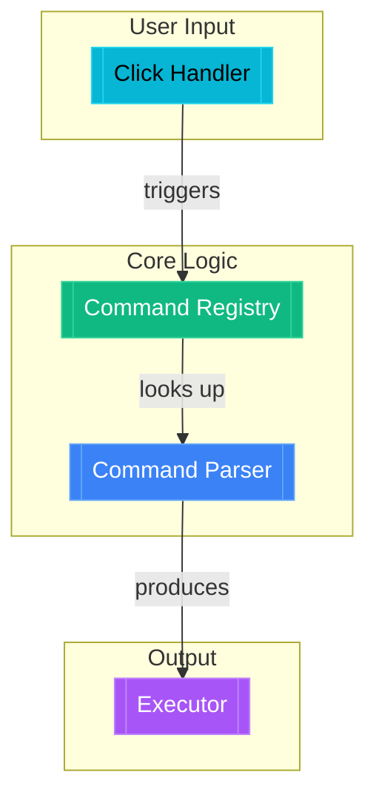

# Codebase Walkthrough Generator

Generate interactive HTML files with clickable Mermaid diagrams that give new developers a **quick mental model** of how a feature or system works. The goal is fast onboarding — a rough map of concepts and connections, not a code reference. Each walkthrough should be readable in under 2 minutes.

**Always dark mode.** Every walkthrough uses a pure black background (`#000000`), white text, and purple accents. Never generate light-mode walkthroughs.

## Workflow

### Step 1: Understand the scope

Clarify what the user wants explained:
- A specific feature flow (e.g., "how does canvas drawing work")
- A data flow (e.g., "how does state flow from composable to component")
- An architectural overview (e.g., "how are features organized")
- A request lifecycle (e.g., "what happens when a user clicks draw")
- A database schema (e.g., "explain the tables and relationships")
- A data model (e.g., "how is user data structured")

Frame the walkthrough as a **mental model for someone new**. Think: "What are the 5-12 key concepts, and how do they connect?"

If the request is vague, ask one clarifying question. Otherwise proceed.

### Step 2: Explore the codebase with parallel subagents

**Always read real source files before generating.** Never fabricate code paths.

**Use the Task tool to delegate exploration to subagents.** This keeps the main context clean for HTML generation and parallelizes the research phase.

#### 2a. Identify areas to explore

Do a quick Glob/Grep yourself (1-2 calls max) to identify the relevant directories and file groups. Then split the exploration into 2-4 independent research tasks.

#### 2b. Launch parallel Explore subagents

Use `Task` with `subagent_type: "Explore"` to launch multiple agents **in a single message** (parallel). Each agent should investigate one area and report back the **purpose and connections** of each piece — not code dumps.

**Give each subagent a focused prompt that asks it to return a structured report with:**
- What the piece does (purpose) and why it exists (role in the system)
- How it connects to other pieces (imports, calls, data flow)
- A suggested node ID (camelCase) and plain-English label (e.g., "Drawing Interaction", not "useDrawingInteraction()")
- The primary file path(s)
- **Only if truly illuminating**: a single key code snippet (max 5 lines) — most nodes should have no code

**Tell each subagent to format its report as a list of nodes like this:**

```
NODE: drawingInteraction
  label: Drawing Interaction
  file: app/features/tools/useDrawingInteraction.ts
  purpose: Converts pointer events into shape data. This is the bridge between raw mouse input and the element model.
  connects_to: canvasRenderer (feeds shape data), toolState (reads active tool)
  key_snippet (optional):
    const element = createElement(tool, startPoint, currentPoint)
    lang: typescript
```

Note: Most nodes should NOT include a snippet. Only include one when it's the single most illuminating piece — a key type definition, the core 3-line algorithm, etc.

**Example: splitting a "drawing tool" walkthrough into subagents:**

```
Subagent 1: "Explore user input handling"
→ Read tool selection, pointer event handling
→ Report: purpose of each piece, how they connect

Subagent 2: "Explore rendering pipeline"
→ Read canvas rendering, scene management
→ Report: what renders elements, how it gets triggered

Subagent 3: "Explore element model and state"
→ Read element types, state management
→ Report: how elements are stored, what shape they have
```

**Do NOT read the files yourself** — let the subagents do it. Your job is to orchestrate and then synthesize their results into the HTML.

#### 2c. Synthesize subagent results (no more file reads)

Once all subagents return, you have everything needed. **Do NOT read any more files or launch more subagents.** Go directly to Steps 3-4.

Combine subagent findings into:
1. **Node list** — ID, plain-English label, primary file(s), 1-2 sentence description, optional code snippet + lang
2. **Edge list** — which nodes connect, with plain verb labels ("triggers", "feeds into", "produces")
3. **Subgraph groupings** — 2-4 groups with approachable labels ("User Input", "Processing", "Output")

**Keep to 5-12 nodes total.** Each node represents a *concept*, not a function. Group related functions into a single node. If you have more than 12 nodes, merge related ones.

If a subagent's report is missing info for a node, drop that node rather than reading files yourself.

### Step 3: Choose the diagram type

Pick the Mermaid diagram type based on the topic:

| Topic | Diagram Type | Mermaid Syntax |
|-------|-------------|----------------|
| Feature flows, request lifecycles, architecture | **Flowchart** | `graph TD` / `graph LR` |
| Database schemas, table relationships, data models | **ER Diagram** | `erDiagram` |
| Mixed (API flow + DB schema) | **Both** — render two diagrams side by side or stacked | Flowchart + ER |

**Diagram sizing**: Keep to **5-12 nodes** grouped into **2-4 subgraphs**. This keeps the diagram scannable at a glance.

#### Flowchart (`graph TD` / `graph LR`)

**Direction**: Use `graph TD` (top-down) for hierarchical flows, `graph LR` (left-right) for sequential pipelines.

**Node types** (styled by category):
| Type | Style | Use for |
|------|-------|---------|
| `component` | Purple | Main components, pages, processors |
| `utility` | Blue | Utils, helpers, pure functions |
| `external` | Gray | Libraries, browser APIs, external services |
| `event` | Cyan | Events, user actions, triggers, entry points |
| `data` | Green | Stores, state, data structures, config |

**Subgraphs**: Group related nodes into 2-4 subgraphs with approachable mental-model labels (e.g., "User Input", "Core Logic", "Visual Output") — not technical layer names.

**Node IDs**: Use descriptive camelCase IDs that map to the detail data (e.g., `drawingInteraction`, `canvasRenderer`).

**Node labels in Mermaid**: Use plain-English labels — "Drawing Interaction", "Canvas Rendering" — not function names or file names.

**CRITICAL: Node sizing** — Nodes must be wide enough to contain their text. Always set explicit width using Mermaid's `style` syntax:
```mermaid
nodeId[["Node Label"]]:::component
style nodeId width:180px,height:60px
```
- Default width: `180px` (increase to `220px` for longer labels)
- Default height: `60px` (increase if needed)
- Apply `style` directive after the node definition
- This ensures text fits properly and nodes are visually balanced

**Edges**: Label with plain verbs — "triggers", "feeds into", "reads", "produces", "watches". Not API method names.

#### ER Diagram (`erDiagram`)

Use for database-related walkthroughs: schema design, table relationships, migrations, data models.

**Syntax**:
```
erDiagram
    USERS {
        string id PK
        string email UK
        string name
        timestamp created_at
    }
    TEAMS {
        string id PK
        string name
        string owner_id FK
    }
    TEAM_MEMBERS {
        string team_id FK
        string user_id FK
        string role
    }
    USERS ||--o{ TEAM_MEMBERS : "joins"
    TEAMS ||--o{ TEAM_MEMBERS : "has"
    USERS ||--o{ TEAMS : "owns"
```

**Relationship cardinality**:
| Syntax | Meaning |
|--------|---------|
| `\|\|--o{` | One to many |
| `\|\|--\|\|` | One to one |
| `}o--o{` | Many to many |
| `\|\|--o\|` | One to zero-or-one |

**Column markers**: `PK` (primary key), `FK` (foreign key), `UK` (unique).

**Click handlers on ER diagrams**: Entities in ER diagrams don't natively support Mermaid `click` callbacks. Instead, add click listeners manually after render via `querySelectorAll('.entityLabel')` — see html-patterns.md for the pattern.

### Step 4: Generate the HTML file

Create a single self-contained HTML file following the patterns in [references/html-patterns.md](references/html-patterns.md).

**IMPORTANT**: Use the **native JavaScript approach** (not React) for maximum browser compatibility and reliability. React UMD can fail due to CDN issues or browser extension conflicts.

**File location**: Write to the project root as `walkthrough-{topic}.html` (e.g., `walkthrough-canvas-drawing.html`). Use kebab-case for the topic slug.

**Architecture**: The HTML uses `<script type="module">` (native ES modules):
- Template literals (backticks) work fine — use them freely for multi-line strings
- Mermaid loaded as ESM module from cdn.jsdelivr.net
- **No React** — use native DOM APIs and event listeners
- Pan/zoom with pointer events and wheel events

**CRITICAL for click handlers to work**:
1. Use ESM import: `import mermaid from 'https://cdn.jsdelivr.net/npm/mermaid@11/dist/mermaid.esm.min.mjs';`
2. Set `securityLevel: 'loose'` in mermaid.initialize()
3. **Always create a node name to ID mapping** — Mermaid node labels don't always match your NODES keys:
   ```js
   // Create explicit mapping from display names to node IDs
   const NODE_NAME_MAP = {
       'Drawing Interaction': 'drawingInteraction',
       'Canvas Renderer': 'canvasRenderer',
       'Tool State': 'toolState',
       // ... map ALL your nodes
   };

   function mapNodeTextToId(nodeText) {
       const trimmed = nodeText?.trim();
       if (!trimmed) return null;

       // Direct mapping
       if (NODE_NAME_MAP[trimmed]) return NODE_NAME_MAP[trimmed];

       // Case-insensitive fallback
       const lowerText = trimmed.toLowerCase();
       for (const [name, id] of Object.entries(NODE_NAME_MAP)) {
           if (name.toLowerCase() === lowerText) return id;
       }
       return null;
   }

   // Then attach click handlers
   container.querySelectorAll('.node').forEach(node => {
       const nodeText = node.querySelector('.nodeLabel')?.textContent;
       const nodeId = mapNodeTextToId(nodeText);
       if (nodeId && NODES[nodeId]) {
           node.style.cursor = 'pointer';
           node.addEventListener('click', (e) => {
               e.stopPropagation();
               showDetail(nodeId);
           });
       }
   });
   ```

**CRITICAL z-index layering** — Ensure UI elements stack correctly:
```css
/* z-index hierarchy (highest to lowest) */
.detail-panel        { z-index: 200; }  /* Right detail overlay */
.controls            { z-index: 150; }  /* Zoom buttons (must be clickable!) */
.header              { z-index: 120; }  /* Title and TL;DR */
.legend              { z-index: 110; }  /* Color legend */
```

**Do NOT use** `bindFunctions` or `window.nodeClickHandler` — these Mermaid APIs are unreliable with browser extensions.

**Required elements**:
1. Title and subtitle describing the walkthrough scope
2. **TL;DR summary** — 2-3 sentences rendered as a collapsible pill (collapsed by default)
3. Mermaid flowchart with clickable nodes (5-12 nodes)
4. Pan/zoom controls (scroll to zoom, drag to pan, fit button)
5. Legend showing node type color coding
6. Detail panel (slides in from right, shows on node click)

**Node detail data** — for each node, include:
```js
nodeId: {
  title: "Drawing Interaction",
  description: "Converts pointer events into shape data. This is the bridge between raw mouse input and the element model.",
  files: ["app/features/tools/useDrawingInteraction.ts"],
  // Optional — only include if it's the single most illuminating snippet
  code: `const element = createElement(tool, startPoint, currentPoint)`,
  lang: "typescript",
}
```

Key points:
- `description` = 1-2 plain-text sentences. Answer "what is this?" and "why does it exist?" Not "how does it work internally?"
- `code` = **optional**. Only include if it's the single most illuminating snippet. Max 5 lines. Most nodes should have no code.
- `lang` = Shiki language identifier. Only needed if `code` is present.
- `files` = array of `"path"` or `"path:lines"` strings.

**After writing the file**, open it in the user's browser:
```bash
open walkthrough-{topic}.html    # macOS
```

## Mermaid Conventions

### Click binding
Use Mermaid's callback syntax to make nodes interactive:
```
click nodeId nodeClickHandler "View details"
```

Where `nodeClickHandler` is a global JS function defined in the HTML.

### Subgraph naming
Use approachable mental-model labels:
```
subgraph user_input["User Input"]
subgraph core_logic["Core Logic"]
subgraph visual_output["Visual Output"]
```

### Edge labels
Use plain verbs:
```
A -->|"triggers"| B
A -.->|"watches"| C
A ==>|"produces"| D
```

Use `-->` for direct calls, `-.->` for reactive/watch relationships, `==>` for events/emissions.

### Complete flowchart example with proper node sizing



**Key points:**
- Each node has a `style` directive with explicit `width` and `height`
- Longer labels get wider nodes (e.g., `200px` vs `180px`)
- All nodes share consistent `height:60px` for visual balance

## Quality Checklist

Before finishing, verify:
- [ ] Diagram has **5-12 nodes** (not more)
- [ ] Every node label is plain English (no function signatures or file names)
- [ ] **CRITICAL**: All nodes have explicit width/height styling (e.g., `style nodeId width:180px,height:60px`)
- [ ] No node description exceeds 2 sentences
- [ ] Code snippets are absent or ≤5 lines (most nodes have no code)
- [ ] TL;DR summary is present and ≤3 sentences
- [ ] Every node maps to a real file in the codebase
- [ ] Code snippets (where present) are actual code, not fabricated
- [ ] File paths are correct and relative to project root
- [ ] The flowchart accurately represents the real code flow
- [ ] **CRITICAL**: Uses ESM import for Mermaid (`import mermaid from '.../mermaid.esm.min.mjs'`)
- [ ] **CRITICAL**: `securityLevel: 'loose'` is set in mermaid.initialize()
- [ ] **CRITICAL**: Manual click handlers attached via querySelector (NOT using bindFunctions)
- [ ] **CRITICAL**: `NODE_NAME_MAP` is created with ALL nodes mapped from display name to ID
- [ ] **CRITICAL**: `mapNodeTextToId()` function handles case-insensitive matching
- [ ] **CRITICAL**: z-index layering: controls=150, header=120, legend=110, detail-panel=200
- [ ] **TESTED**: Pan/zoom works (scroll wheel zooms, drag pans)
- [ ] **TESTED**: Zoom In/Out/Fit buttons are clickable (not blocked by other elements)
- [ ] **TESTED**: Clicking any node shows detail panel
- [ ] The diagram renders without Mermaid syntax errors
- [ ] The HTML file opens correctly in a browser
- [ ] Detail panel shows correctly formatted code and file paths
- [ ] Subgraph labels are approachable ("User Input") not technical ("Composable Layer")
- [ ] Edge labels are plain verbs ("triggers") not method names ("handlePointerDown()")

## Troubleshooting

### HTML file not displaying in browser

1. **Check for JavaScript errors** — Open browser DevTools Console (F12)
2. **CDN loading issues** — Ensure cdn.jsdelivr.net is accessible
3. **ESM support** — Modern browsers required (Chrome 61+, Firefox 60+, Safari 11+)
4. **File protocol** — Some browsers block ESM on file:// protocol, use a local server if needed

### Click handlers not working

If clicking nodes doesn't show detail panels:

1. **Check console errors** — Look for JavaScript errors
2. **Verify node text mapping** — Ensure the node label text matches your mapping:
   ```js
   const nodeMap = {
       'cli entry point': 'cli_entry',  // Exact match to label text
       'command handlers': 'commands',
   };
   ```
3. **Check querySelector** — Verify `.node` elements exist after render
4. **Test in incognito mode** — Disable all extensions to verify if extension is the culprit

### Diagram not rendering

1. Check Mermaid syntax in DIAGRAM constant
2. Verify `startOnLoad: false` is set
3. Check for syntax errors in subgraph definitions (matching brackets)

### Pan/zoom not working

1. Verify viewport and canvas divs exist
2. Check that pointer events are not blocked by other elements
3. Ensure wheel event listener has `{ passive: false }`

## References

- [references/html-patterns.md](references/html-patterns.md) — React-based reference (use native JS approach instead for better compatibility)
